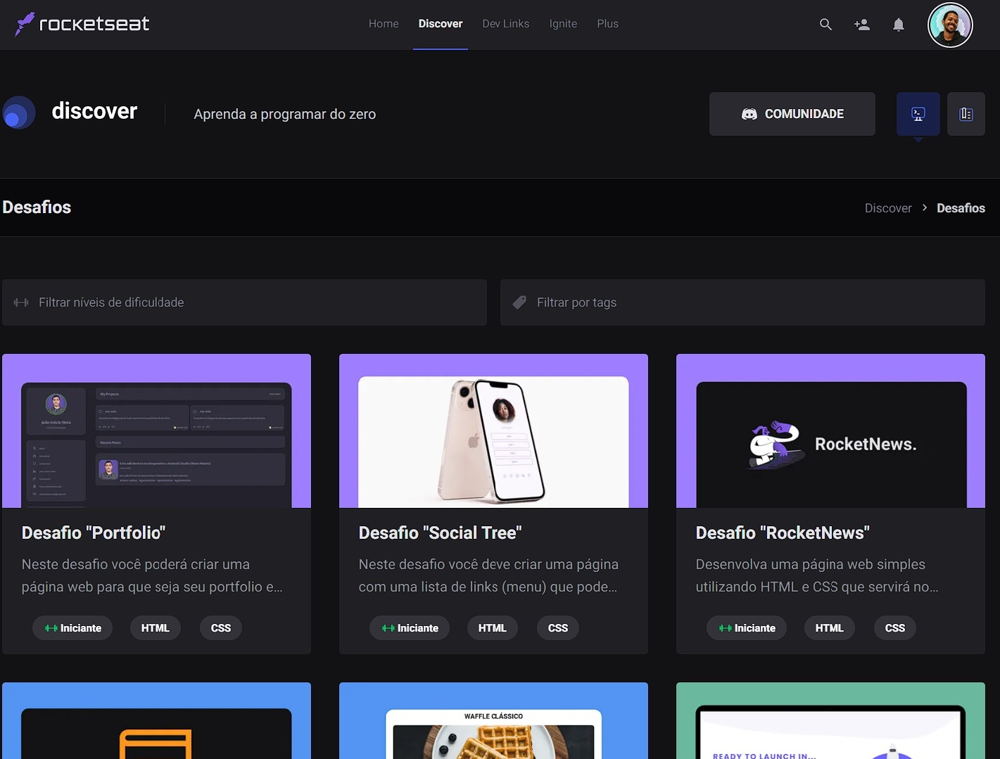

<h1 align="center"> Project RocketSeat </h1>

Projetos e desafios gratuitos, promovido pela Rocketseat para ensino de tecnologias WEB.

  <a href="#-tecnologias">Tecnologias</a>&nbsp;&nbsp;&nbsp;|&nbsp;&nbsp;&nbsp;
  <a href="#-projeto">Projeto</a>&nbsp;&nbsp;&nbsp;|&nbsp;&nbsp;&nbsp;
  <a href="#memo-licença">Licença</a>

  

 

  

## 🚀 Tecnologias

Esse projeto foi desenvolvido com as seguintes tecnologias:

- HTML e CSS
- JavaScript
- Git e GitHub

## 💻 Projetos

Projetos e disafios propostos pela plataforma da RocketSeat para melhoria da capaciadade de 'webinnar'.

<a href="https://soulwash.github.io/RocketSeatDesafios/Desafios/Project-DevLinks/">DevLinks</a> 
<a href="https://soulwash.github.io/RocketSeatDesafios/Projetos/ELNightmare" target="_black">Page EndLess Nightmare</a> 
<a href="https://soulwash.github.io/RocketSeatDesafios/Projetos/TravelExpert" target="_black">Travel Expert</a> 
<a href="https://soulwash.github.io/RocketSeatDesafios/Projetos/HRecipes" target="_black">Healthy Recipes</a> 
<a href="https://soulwash.github.io/RocketSeatDesafios/Desafios/DesafioPlanos" target="_black">Pricing Table</a> 
<a href="https://soulwash.github.io/RocketSeatDesafios/Desafios/DesafioRocketNFTs" target="_black">Rocket NFTs</a> 
<a href="https://soulwash.github.io/RocketSeatDesafios/Projetos/NLWSpaceTime" target="_black">NLW Space Time - Cápsula do tempo</a> 
<a href="https://soulwash.github.io/RocketSeatDesafios/Desafios/MovieIA" target="_black">Movie API</a> 
## :memo: Licença

Esse projeto está sob a licença MIT.

---

Feito com ♥ by Rocketseat :wave: [Participe da nossa comunidade!](https://discord.gg/rocketseat)
